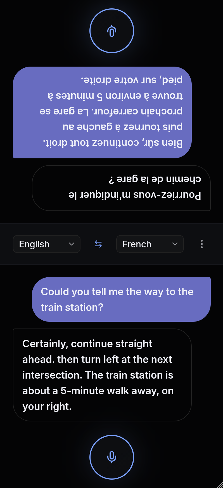

# TwinSpeak



## Overview

TwinSpeak is a real-time translation service designed for tourists and travelers to communicate with foreigners in their native languages. The application breaks down language barriers by providing instant speech-to-speech translation through a web interface.

The platform captures audio from both speakers, transcribes their speech, translates it to the target language, and displays the results in real-time. It supports multiple languages and offers two processing pipelines: Gladia's cloud API or self-hosted Faster Whisper with LibreTranslate. The service includes user authentication, subscription management, and usage tracking.

See `SupportedLanguages` function to find supported languages for [Gladia](backend/internal/speechpipeline/gladia-pipeline.go) and [Whisper](backend/internal/speechpipeline/whisper-pipeline.go) pipelines

## Demo

Demo domain currently located on [www.twinspeak.site](https://www.twinspeak.site)

## Tech stack

- **TanStack Start** – frontend framework (SSR, routing, and server-side state management)
- **Go** – backend
- **PostgreSQL** – database
- **Nginx** – reverse proxy
- **Faster Whisper + LibreTranslate** (optional) – transcription and translation

## Configuration

### Backend Configuration

The backend can be configured using either a YAML file or environment variables. Configuration precedence is as follows: environment variables override YAML file values.

#### Using YAML File

Create `backend/config.yaml` from the provided template:

```bash
cp backend/config-example.yaml backend/config.yaml
```

Edit the file with your actual values:

```yaml
# Host on which app will be listening for HTTP.
host: 0.0.0.0:8080
# Domain used for email redirect links.
public-url: http://www.twinspeak.site
# DB connection string.
db-url: postgresql://postgres:postgres@db:5432/twinspeek
# Secret for JWT encryption.
hmac-secret: some_key
# Pipeline option that determines the transcription and translation provider.
# Currently, two values are supported:
#   - gladia: cloud-based provider
#   - whisper: uses Faster Whisper for transcription and LibreTranslate for translation
# Gladia is the recommended option because it supports real-time streaming transcription and translation.
pipeline: gladia
# Gladia API key (needed for gladia pipeline).
gladia-key: some_key
# Faster Whisper URL (needed for whisper pipeline).
faster-whisper-url: http://whisper:9000
# LibreTranslate URL (needed for whisper pipeline).
libretranslate-url: http://libretranslate:5000
# Scheduler interval (Go duration format).
scheduler-interval: 1h
# Google OAuth 2.0 config.
google:
  client-id: client_id
  client-secret: client_secret
  redirect-url: https://redirect_url
# Resend config (email provider).
resend:
  api-key: some_key
  from-email: noreply@contact.twinspeak.site
```

#### Using Environment Variables

All configuration options can be set via environment variables with the `TWINSPEAK_` prefix. Nested keys use underscores as separators:

```bash
TWINSPEAK_HOST=0.0.0.0:8080
TWINSPEAK_PUBLIC_URL=http://localhost
TWINSPEAK_DB_URL=postgresql://postgres:postgres@db:5432/twinspeek
TWINSPEAK_HMAC_SECRET=your-secret-key-here
TWINSPEAK_PIPELINE=gladia
TWINSPEAK_GLADIA_KEY=your-gladia-api-key
TWINSPEAK_FASTER_WHISPER_URL=http://whisper:9000
TWINSPEAK_LIBRETRANSLATE_URL=http://libretranslate:5000
TWINSPEAK_SCHEDULER_INTERVAL=1h
TWINSPEAK_GOOGLE_CLIENT_ID=your-google-client-id
TWINSPEAK_GOOGLE_CLIENT_SECRET=your-google-client-secret
TWINSPEAK_GOOGLE_REDIRECT_URL=http://localhost/auth/google/callback
TWINSPEAK_RESEND_API_KEY=your-resend-api-key
TWINSPEAK_RESEND_FROM_EMAIL=noreply@yourdomain.com
```

#### Pipeline Options

The `pipeline` setting determines which speech processing backend to use:

- `gladia`: Uses Gladia's cloud API (requires `gladia-key`)
- `whisper`: Self-hosted Faster Whisper with LibreTranslate (requires `faster-whisper-url` and `libretranslate-url`)

Note: The Whisper pipeline requires GPU support. 

## Billing

The application includes a credit-based billing system, though it currently serves as a placeholder without integration to a payment provider. Every user automatically receives a free subscription upon registration, granting 30 minutes of translation time per month. Credits are measured in seconds and automatically renew monthly.

The billing logic is implemented in `backend/internal/billing/billing.go` and tracks:
- Credit grants (monthly allocations and top-ups)
- Credit expenses (time spent on translations)
- Subscription renewals via a scheduler

While the infrastructure supports future payment integration and top-up purchases, all users currently operate on the free tier with monthly credit resets.

## Local Development and Testing

### Development Mode

Development mode uses hot-reload for both backend (Air) and frontend (Vite):

```bash
docker compose -f docker-compose.dev.yml up
```

This starts:
- Backend on `backend:8080` (hot-reload via Air)
- Frontend on `frontend:4321` (accessible via nginx on port 80)
- PostgreSQL 18 on `localhost:5432`
- Nginx reverse proxy on port 80

For Whisper pipeline development with GPU support:

```bash
docker compose -f docker-compose.dev.yml --profile whisper up
```

This additionally starts Faster Whisper and LibreTranslate containers with NVIDIA GPU support.

### Production Mode

Production mode uses built images to provide more realistic environment:

```bash
docker compose -f docker-compose.yml up --build
```

All services run behind nginx on port 80. The database is only exposed to localhost on port 5432.

### Running Tests

Currently, tests are implemented only for the backend. The test suite uses a dedicated PostgreSQL instance that is reset before each test run:

```bash
./test.sh
```

This script:
1. Removes existing test containers and database volume
2. Starts a fresh PostgreSQL instance
3. Runs `go test ./...` against all backend packages
4. Cleans up test containers

Alternatively, run tests manually with docker compose:

```bash
docker compose -f docker-compose.test.yml up --exit-code-from backend
```

The test environment uses the `DB_URL` environment variable to connect to the test database. Each test runs within its own transaction that is rolled back after completion.

## CLI Tool

The project includes a command-line tool for administrative tasks and database seeding, located at `backend/cmd/cli/main.go`. The CLI uses the same configuration as the main server and provides utilities for development and testing.

### Available Commands

**Seed User**

Create a test user with various billing states:

```bash
# Basic user with default 30-minute monthly subscription
./twinspeak-cli seed user email@example.com password123

# User with exhausted monthly credits
./twinspeak-cli seed user email@example.com password123 --used-sub

# User with active top-ups (in seconds)
./twinspeak-cli seed user email@example.com password123 --active-topup 600 --active-topup 1200

# User with expired top-ups
./twinspeak-cli seed user email@example.com password123 --expired-topup 300

# Combined scenario
./twinspeak-cli seed user email@example.com password123 --used-sub --active-topup 1800
```

The `seed user` command automatically verifies the email address, so the user is immediately ready to use the service. This is useful for quickly setting up test accounts with different credit states during development.
